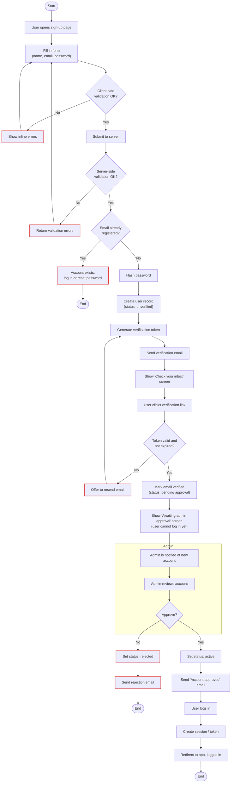

# Sign-up flow

A new account goes through email verification and then needs an admin's approval before the user can log in.

```mermaid
flowchart TD
    start([Start]) --> open[User opens sign-up page]
    open --> form["Fill in form<br/>(name, email, password)"]
    form --> clientValid{Client-side<br/>validation OK?}
    clientValid -- No --> inlineErr[Show inline errors]
    inlineErr --> form
    clientValid -- Yes --> submit[Submit to server]

    submit --> serverValid{Server-side<br/>validation OK?}
    serverValid -- No --> serverErr[Return validation errors]
    serverErr --> form
    serverValid -- Yes --> exists{Email already<br/>registered?}
    exists -- Yes --> existsMsg["Account exists:<br/>log in or reset password"]
    existsMsg --> endExists([End])
    exists -- No --> hash[Hash password]
    hash --> create["Create user record<br/>(status: unverified)"]

    create --> token[Generate verification token]
    token --> sendMail[Send verification email]
    sendMail --> inbox[Show 'Check your inbox' screen]
    inbox --> clickLink[User clicks verification link]
    clickLink --> tokenValid{Token valid and<br/>not expired?}
    tokenValid -- No --> resend[Offer to resend email]
    resend --> token
    tokenValid -- Yes --> verified["Mark email verified<br/>(status: pending approval)"]
    verified --> waiting["Show 'Awaiting admin approval' screen<br/>(user cannot log in yet)"]

    waiting --> notifyAdmin
    subgraph admin [Admin]
        notifyAdmin[Admin is notified of new account] --> review[Admin reviews account]
        review --> approved{Approve?}
    end

    approved -- No --> rejected["Set status: rejected"]
    rejected --> rejectMail[Send rejection email]
    rejectMail --> endRejected([End])
    approved -- Yes --> active["Set status: active"]
    active --> approvedMail[Send 'Account approved' email]
    approvedMail --> login[User logs in]
    login --> session[Create session / token]
    session --> app[Redirect to app, logged in]
    app --> endOk([End])

    classDef error stroke:#d33,stroke-width:2px
    class inlineErr,serverErr,existsMsg,resend,rejected,rejectMail error
```
